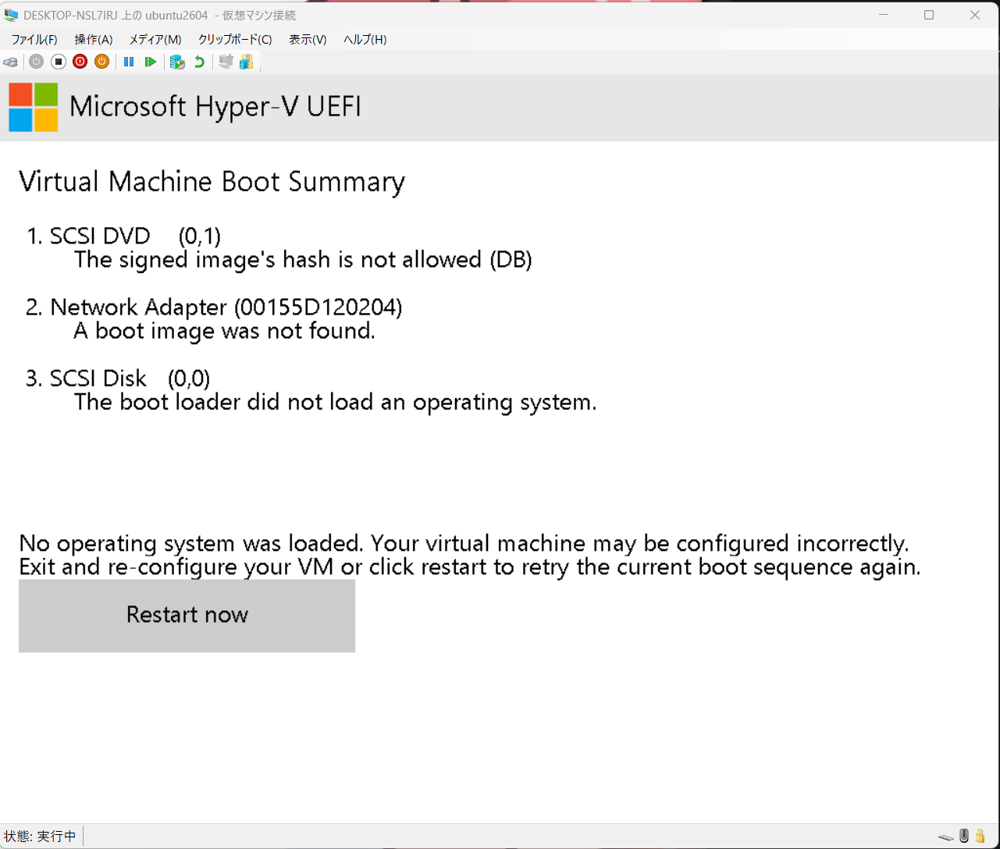
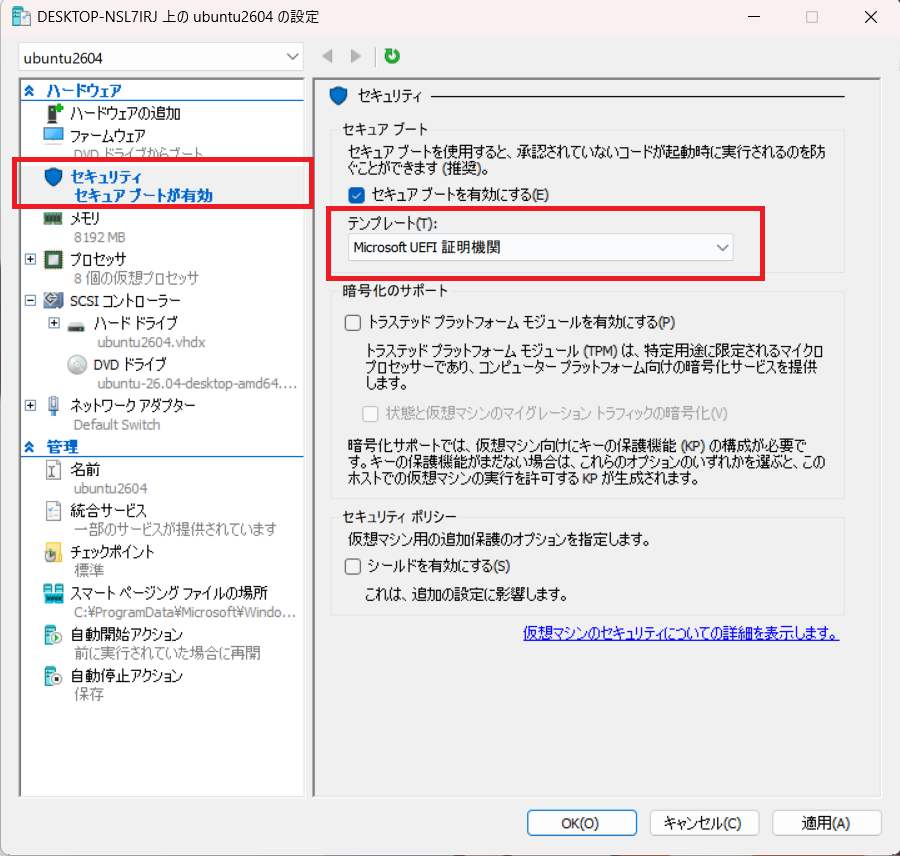

# Hyper-V

Windows搭載の機能でハイパーバイザ型のVMが作れる。
WSLと共存できる。WSLを入れた状態ではVirtualBoxは動作が遅くて使えない。

## UEFI

ubuntuを入れるとき、UEFIが設定がデフォルトで`Microsoft Windows`になっている。
この状態だと起動しない。画像のようなエラーがでる



設定を`Miscrosoft UEFI 証明期間`に変更すると起動する



## 削除

以下にディスクが残こり続けるので削除する

```shell
C:\ProgramData\Microsoft\Windows\Virtual Hard Disks
```

## 拡張セッション

VirtualBoxのGuestAdditionsのようなもの
Ubuntuがゲストの場合うまく機能しない。

## vscode

vscodeはWindows側に入れて、WSLのプラグイン入れておけばおｋ
wsl側にいれると以下のように出る。

```shell
hyt@DESKTOP-NSL7IRJ:~$ code .
To use Visual Studio Code with the Windows Subsystem for Linux, please install Visual Studio Code in Windows and uninstall the Linux version in WSL. You can then use the `code` command in a WSL terminal just as you would in a normal command prompt.
Do you want to continue anyway? [y/N] y
To no longer see this prompt, start Visual Studio Code with the environment variable DONT_PROMPT_WSL_INSTALL defined.
```

## use gh in wsl

```shell
export BROWSER="/mnt/c/Program\ Files\ (x86)/Microsoft/Edge/Application/msedge.exe"
gh auth login --web
# use windows browser
```

ghのログイン情報移行するには、ghの設定ファイルだけコピーしてくればOK

```shell
$HOME/.config/gh
```

## xrdp

Ubuntuがゲストの場合、xrdpを使って、クリップボードの共有や、画面サイズの動的な変更を実現する
