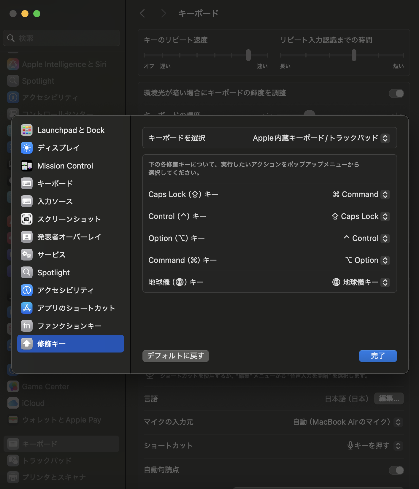

# mac

macのtips

## ノートPCで画面を開いたときに自動で起動するのを停止する

<https://support.apple.com/en-us/120622>

```shell
sudo nvram BootPreference=%00
```

## キーボードの配置を入れ替えてwindowsの操作感に近づける

設定 -> キーボード -> キーボードショートカット -> 修飾キー

- Caps Lock -> Command
- Control -> Caps Lock
- Option -> Control
- Command -> Option



## ショートカット入れ替え

設定 -> キーボード -> キーボードショートカット -> キーボード

次のウィンドウを操作対象にする　-> Option + Tab

<https://zenn.dev/yumainaura/articles/qiita-2023-12-16t22_02_36-09_00>

## 標準function key

設定 -> キーボード -> キーボードショートカット -> ファンクションキー

「F1、F2などのキーを標準のファンクションキーとして使用」

<https://support.apple.com/ja-jp/102439>

## 設定変更

<https://dev.classmethod.jp/articles/mac-recommended-initial-settings/>

## ghostty ssh setting

<https://ghostty.org/docs/help/terminfo#configure-ssh-to-fall-back-to-a-known-terminfo-entry>
