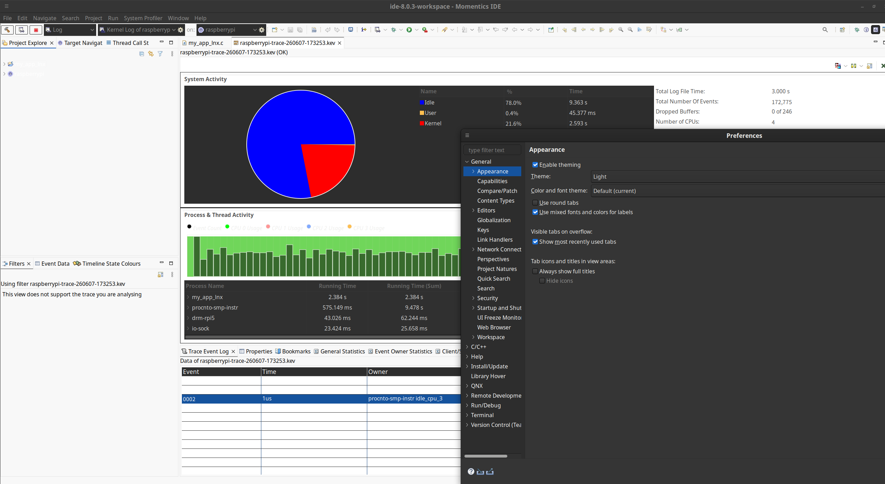

# QNX

RPi5で動くQNXのTIPS

## Ref

- <https://zenn.dev/tasada038/articles/f7e81d709775ee>
- <https://www.qnx.com/developers/docs/qnxeverywhere/com.qnx.doc.target_images/topic/qsti/intro.html?ref=devblog.qnx.com>
- <https://www.qnx.com/developers/docs/qnxeverywhere/com.qnx.doc.target_images/topic/qsti/next-steps.html>
- <https://www.qnx.com/developers/docs/qnxeverywhere/com.qnx.doc.target_images/topic/qsti/qnxos_on_rpi.html>

## シャットダウン

シャットダウンしても、LEDランプの色変わらないし、ファンも回り続ける。
pingとかで確かめてから電源ケーブル抜く

```shell
# シャットダウン
sudo shutdown -b

# 再起動
sudo shutdown
sudo shutdown -S reboot
```

## ssh設定

```shell
Host qnxpi
  HostName qnxpi.local
  User qnxuser
  MACs hmac-sha2-256
  PasswordAuthentication yes
  StrictHostKeyChecking ask
```

## Momentics theme

UbuntuでOS側がダークテーマを使っていると、表示がおかしくなる。



起動用のショートカットに環境変数追加してLightを強制する

```shell
# qde.desktop
Exec=env GTK_THEME=Adwaita /home/hyt/qnx/qnxmomenticside/qde
```

## 困りごと

### 日本語キーボードの一部が認識しない

公式の設定どおりにやっても、¥ ] \_ 半角全角がだめ

keymap = /usr/share/keyboard/ja_JP_106
